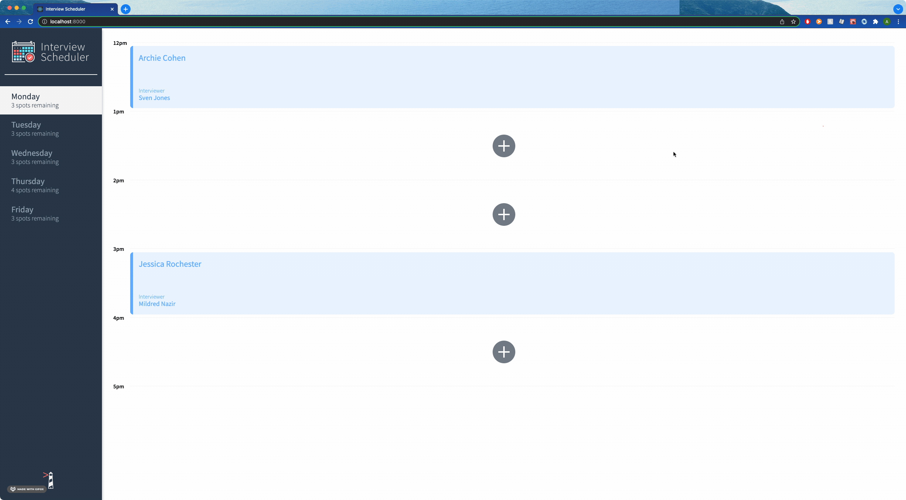
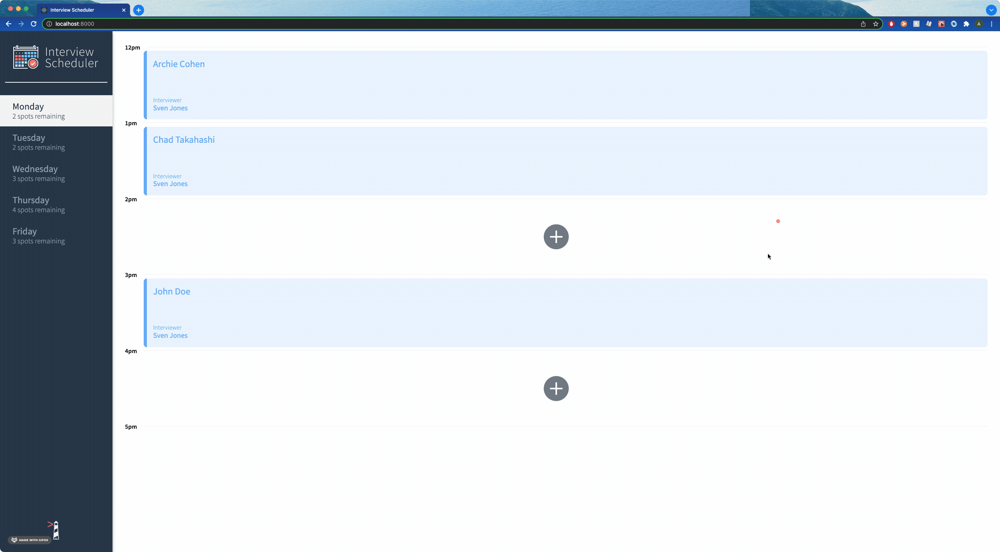
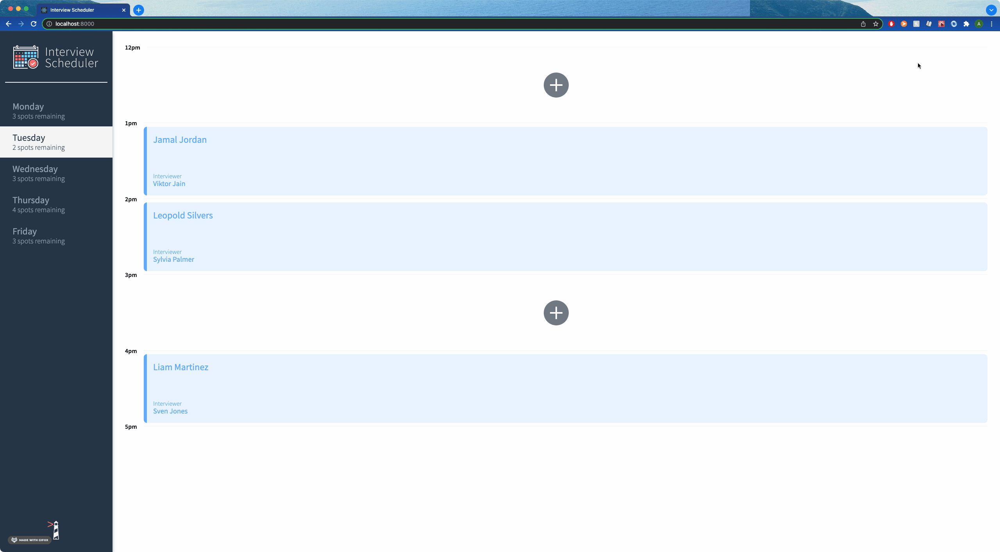

# Interview Scheduler

A react application that allows users to book interviews within a schedule with selected interviewers.

## Setup

Install dependencies with `npm install`.

## Running Webpack Development Server

```sh
npm start
```

## Running Jest Test Framework

```sh
npm test
```

## Running Storybook Visual Testbed

```sh
npm run storybook
```
## E2E testing with Cypress

```sh
npm run cypress
```

# Screenshots

### Add an appointment


### Edit an appointment


### Delete an appointment
